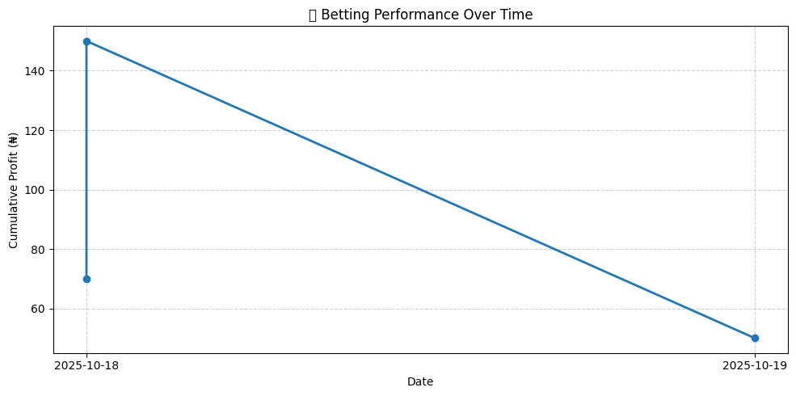

# ⚽ Betting Prediction Tracker (Python)

[](https://www.python.org/)
[](https://pandas.pydata.org/)
[](https://matplotlib.org/)
[](LICENSE)

> 🧠 A data-driven way to track and improve your football betting predictions using Python — built for learning, analytics, and strategic growth.

---

## 📋 Overview

The **Betting Prediction Tracker** is a lightweight analytics system that helps you:

- Log your predictions and match outcomes  
- Automatically calculate **profit, ROI, and accuracy**  
- Evaluate your **Expected Value (EV)** per bet  
- Visualize performance with a **profit trend graph**

Built with **Python**, **Pandas**, and **Matplotlib**, it transforms your betting activity into structured, measurable data — helping you think more like an analyst than a gambler.

---

## 🧩 Features

### 🟢 Basic Tracker
- Record match predictions, odds, and results  
- Auto-calculate **profit/loss** per bet (₦100 base stake)  
- Summarize **total profit**, **ROI**, and **win rate**  
- Automatically saves to CSV (`predictions_tracker.csv`)

### 🔵 Advanced Tracker
- Adds **Expected Value (EV)** calculations  
- Generates **cumulative profit graph**  
- Includes deeper metrics: ROI, EV, accuracy comparison  
- Detects if results match your predictions (✅ *On Track* / ⚠️ *Needs Review*)  
- Fully compatible with existing CSV data  

---

## ⚙️ Installation

```bash
# Clone the repository
git clone https://github.com/yourusername/betting-tracker.git
cd betting-tracker

# (Optional) Create a virtual environment
python -m venv venv
source venv/bin/activate  # On Windows: venv\Scripts\activate

# Install dependencies
pip install -r requirements.txt

Or manually:

pip install pandas matplotlib
```


---

## 🧮 Usage

### 🧱 1️⃣ Create or Load Tracker

The script automatically creates `predictions_tracker.csv` on first run.

### 📝 2️⃣ Add a Prediction

```python
from tracker import add_prediction, summary, plot_performance

add_prediction(
    date="2025-10-18",
    league="Serie A",
    match="Torino vs Napoli",
    your_pick="Napoli to Win",
    result="1-2",
    odds=1.70,
    outcome="win",
    win_prob=0.65  # 65% estimated chance
)

summary()
plot_performance()
```

---

## 📊 Example Output
```
✅ Added: Napoli vs Torino (WIN) | Profit: ₦70.00 | EV: ₦5.50

📊 --- Betting Tracker Summary ---
Total Bets: 10
Wins: 6 | Losses: 4 | Pushes: 0
Win Rate: 60.00%
Total Profit: ₦120.00
ROI: 12.00%
Average EV: ₦3.80
Predicted Accuracy vs. Real: ✅ On Track
```
## 📈 Profit Chart Example:




---

## 📘 Metric Glossary

### Metric	Description

- Profit	Net gain/loss per bet (₦100 stake assumed)

- ROI (Return on Investment)	(Total Profit ÷ Total Stake) × 100

- EV (Expected Value)	Long-term mathematical profitability of your bets

- Win Rate	% of successful bets

- Cumulative Profit	Running total of profit across all predictions


---

## 🔢 Expected Value Formula

EV = (P_{win} \times (odds - 1) \times stake) - ((1 - P_{win}) \times stake)

Where:

( P_{win} ): Your estimated win probability

( stake ): Default ₦100

Positive EV → good value

Negative EV → unprofitable long term


---

## 🧱 File Structure
```
betting-tracker/
│
├── images
       └── performance_chart.png        # a sample image of the performance chart
├── bet_tracker.py                      # First bet tracker
├── bet_tracker2.py                     # Second bet tracker
├── predictions_tracker.csv             # Auto-created data log
├── README.md                           # This documentation file
└── requirements.txt                    # Dependencies (pandas, matplotlib)
```

---

## 🚀 Planned Features

✅ Bankroll tracking and automatic updates

✅ Kelly Criterion for optimal stake sizing

✅ Drawdown and risk management analytics

✅ Streamlit web dashboard for live visualization

✅ Import/export match data via APIs


---

## 🧑‍💻 Author

Sochima Madu

> Philosopher 🧩 • Coder 💻 • Data-driven Thinker ⚙️


Exploring the intersection of analytics, technology, and strategic thinking.
“Bet smart, not often — data never lies.”


---

## 📄 License

This project is licensed under the MIT License.


---

## 🌟 Show Your Support

If you find this project useful:

⭐ Star it on GitHub

🧩 Fork and improve it

💬 Share ideas via pull requests or issues


---

Made with ❤️ and Python for smarter betting insights.

---


Made with ❤️ and Python for smarter bett
